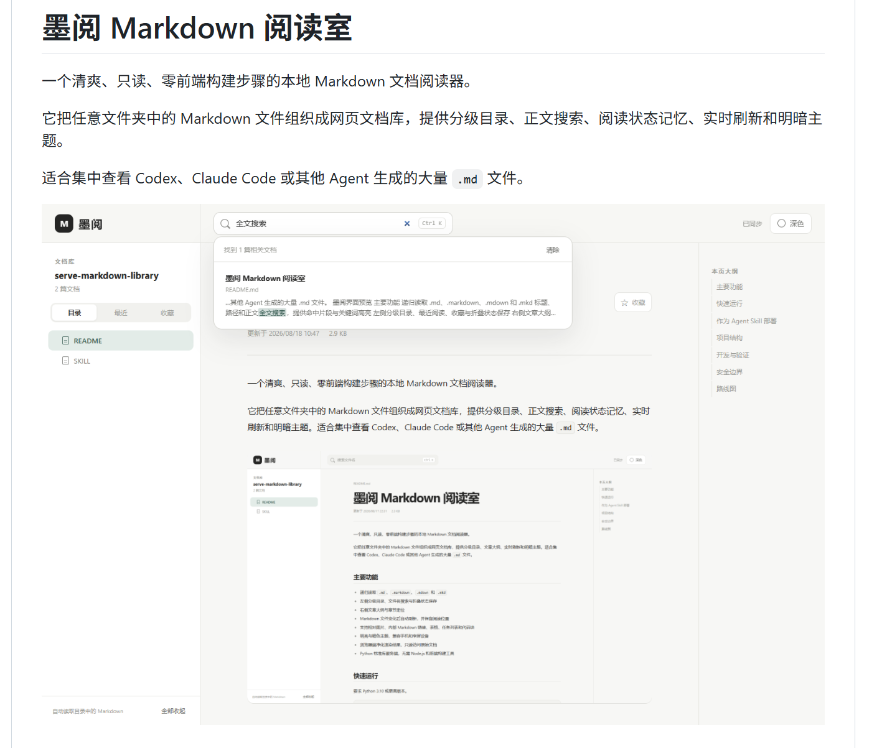

# 墨阅 Markdown 阅读室

一个清爽、只读、零前端构建步骤的本地 Markdown 文档阅读器。

它把一个或多个文件夹中的 Markdown 文件组织成统一网页书架，提供来源切换、分级目录、跨库正文搜索、阅读状态记忆、实时刷新和可扩展主题中心。

适合集中查看 Codex、Claude Code 或其他 Agent 生成的大量 `.md` 文件，不需要移动原文件。



## 主要功能

- 递归读取 `.md`、`.markdown`、`.mdown` 和 `.mkd`
- 同时挂载多个本地目录，按 Codex、Claude 等来源分组和筛选
- 用户不知道路径时，只读检查常见 Agent 目录并给出候选与参考位置
- 跨文档库搜索标题、路径和正文，也可只搜索当前来源
- 不同来源中的同名、同路径文件彼此隔离
- 左侧分级目录、最近阅读、收藏与折叠状态保存
- 右侧文章大纲与章节定位
- 每篇文档独立记忆阅读位置，重启浏览器后继续阅读
- 后台缓存目录与增量正文索引，文件变化后自动刷新
- 支持相对图片、内部 Markdown 链接、表格、任务列表和代码块
- 墨阅、GitHub、Notion、Codex、Claude 五种阅读风格
- 每种风格均支持浅色、深色和跟随系统，选择自动保存在浏览器中
- 主题在页面绘制前恢复，避免刷新时出现明暗闪烁
- 兼容手机和窄屏设备
- 浏览器端净化渲染结果，只读访问原始文档
- Python 标准库服务端，无需 Node.js 和前端构建工具

## v0.3 主题中心

顶部的主题按钮会打开可视化主题中心。风格与明暗模式彼此独立，因此同一种阅读风格可以跟随系统，也可以固定为浅色或深色。主题仅改变本机浏览器中的显示效果，不会修改 Markdown 文件。

GitHub、Notion、Codex 与 Claude 主题是面向阅读场景的灵感设计，并非对应产品的官方主题。

## v0.4 多文档书架

一个阅读室可以同时连接多个互不相干的 Markdown 目录。左侧来源栏负责在“全部”、Codex、Claude 或自定义 Agent 之间切换；选择“全部”时，目录会按来源分组展示，顶部搜索会聚合所有来源并标明每条结果来自哪里。

所有目录都保持原位，阅读室只读访问。内部使用独立路径命名空间，因此多个 Agent 都生成 `README.md` 时也不会互相覆盖。最近阅读、收藏、阅读位置和上次选择的来源仍保存在当前浏览器中。

### v0.4.1 引导式目录发现

目录由用户最终决定。用户知道路径时直接部署；不知道时，Agent 可以运行只读发现工具，检查 Codex、Claude、通用 Agent 等常见位置，并返回候选名称、绝对路径、Markdown 数量、可信度和可复制的部署参数。发现结果不会自动加入书架，也不会扫描整块硬盘。

```bash
python scripts/discover.py
python scripts/discover.py --scan-root "/path/to/projects" --json
```

## 快速运行

要求 Python 3.10 或更高版本。

```bash
python assets/app/server.py --root "/path/to/markdown" --title "我的文档库" --open
```

直接启动多个目录：

```bash
python assets/app/server.py \
  --library "Codex=/path/to/codex-docs" \
  --library "Claude=/path/to/claude-docs" \
  --title "我的 Agent 文档书架" \
  --open
```

默认地址为 `http://127.0.0.1:4173`，仅当前电脑可以访问。

## 作为 Agent Skill 部署

仓库本身同时是一个 Codex Skill。Agent 读取 `SKILL.md` 后，可以使用部署脚本为用户生成独立运行目录：

如果用户不知道 Markdown 在哪里，先运行：

```bash
python scripts/discover.py --json
```

把候选目录和文档数量交给用户确认后，再部署：

```bash
python scripts/deploy.py \
  --library "Codex=/path/to/codex-docs" \
  --library "Claude=/path/to/claude-docs" \
  --output "/path/to/markdown-reading-room" \
  --title "我的 Agent 文档书架"
```

单目录仍可继续使用旧参数 `--content "/path/to/markdown"`。更新现有安装时，只传 `--output` 会保留已经配置的全部来源。

部署后：

- Windows 双击 `start-reader.bat`
- macOS 或 Linux 运行 `./start-reader.sh`

## 项目结构

```text
serve-markdown-library/
├── SKILL.md
├── agents/openai.yaml
├── assets/app/
│   ├── server.py
│   └── static/
├── scripts/
│   ├── discover.py
│   ├── deploy.py
│   └── build_release.py
├── tests/
└── .github/workflows/
```

## 开发与验证

项目仅依赖 Python 标准库。运行完整测试：

```bash
python -m unittest discover -s tests -v
python scripts/build_release.py
```

每次推送和 Pull Request 会在 Windows、macOS、Linux 上运行测试。推送 `v*` 标签后，GitHub Actions 自动生成并上传 Skill ZIP。

版本按同一功能系列连续迭代十个小版本，例如 `v0.4.0` 至 `v0.4.9`，之后再进入 `v0.5.0`。

## 安全边界

- 默认只监听 `127.0.0.1`
- 服务只读取配置目录中的文件，不修改、移动或删除 Markdown
- 每个文档来源分别进行根目录边界校验，不能通过链接或路径跳到其他位置
- 忽略 `.git`、`.venv`、`node_modules` 等目录
- 资源接口限制可访问的文件类型和路径范围
- 当前版本不包含账号系统，不应直接暴露到公网

## 路线图

项目已从以 Agent Skill 为主的部署工具，逐步转向本地优先的跨平台 Markdown 文档产品。网页端、Windows 和 macOS 是当前主线，移动端将在桌面基础稳定后推进。

方向性版本规划与调整原则见 [ROADMAP.md](ROADMAP.md)。路线图用于记录产品方向，不代表固定排期或交付承诺。

欢迎通过 Issue 提交使用场景和改进建议。
