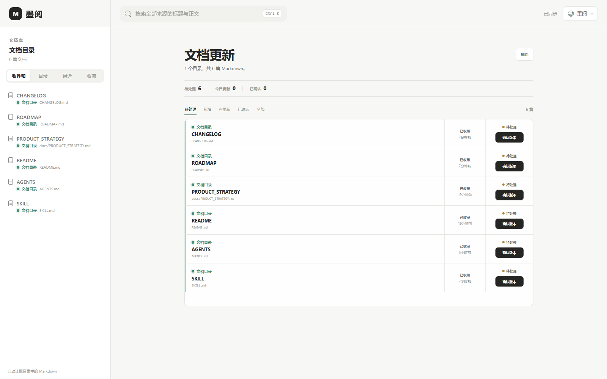
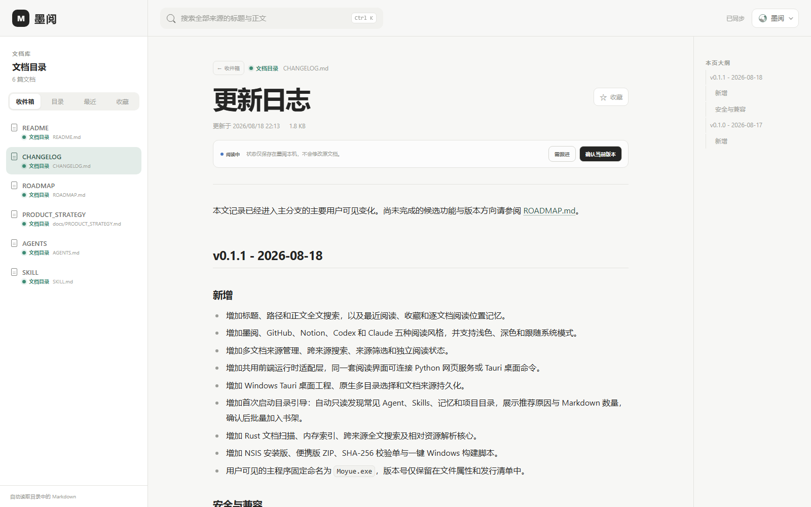
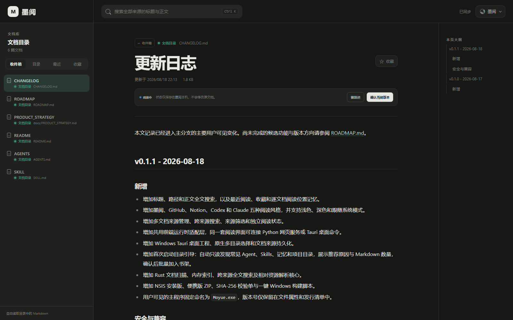

# 墨阅 Markdown 阅读室

[](https://github.com/yan9651688/moyue-reading-room/releases/latest)
[](https://github.com/yan9651688/moyue-reading-room/releases/latest)
[](https://github.com/yan9651688/moyue-reading-room/actions/workflows/ci.yml)

墨阅是一款本地 Markdown 阅读器，适合集中查看 Codex、Claude Code 和其他 Agent 生成的文档。

文件留在原目录。墨阅只读扫描，不上传，也不改写 Markdown。



## 下载

Windows 用户从 [GitHub Releases](https://github.com/yan9651688/moyue-reading-room/releases/latest) 下载：

| 文件 | 用途 |
| --- | --- |
| [Moyue-Setup.exe](https://github.com/yan9651688/moyue-reading-room/releases/latest/download/Moyue-Setup.exe) | 安装版，适合日常使用 |
| [Moyue-Portable.zip](https://github.com/yan9651688/moyue-reading-room/releases/latest/download/Moyue-Portable.zip) | 免安装，解压后运行 `Moyue.exe` |
| [release-manifest.json](https://github.com/yan9651688/moyue-reading-room/releases/latest/download/release-manifest.json) | 文件大小和 SHA-256 校验值 |

安装包暂未签名。若 Windows 出现 SmartScreen 提示，请先确认文件来自本仓库的 Releases 页面。

## 使用

1. 打开墨阅，点“发现目录”。
2. 勾选需要的目录，加入书架。
3. 在“文档更新”中阅读、搜索或确认当前版本。

自动发现没有找到时，可以扫描 `Documents`、工作区或项目父目录；已经知道位置时，直接添加目录即可。

### 常见目录

| 内容 | 常见位置 |
| --- | --- |
| Codex Skills | `~/.codex/skills` |
| Codex 记忆 | `~/.codex/memories` |
| Claude Skills | `~/.claude/skills` |
| 通用 Agent Skills | `~/.agents/skills` |
| 项目文档 | `Documents`、`Desktop`、`Projects`、`Workspace`、OneDrive |

发现阶段只统计目录和 Markdown 数量。目录经过确认后才会加入书架。

## 阅读界面

| 浅色 | 深色 |
| --- | --- |
|  |  |

墨阅提供分级目录、文章大纲、全文搜索、最近阅读、收藏和阅读位置记忆。主题可选墨阅、GitHub、Notion、Codex 或 Claude，并支持浅色、深色和跟随系统。

## 功能

- 同时读取多个本地目录，按来源筛选
- 自动识别 Codex、Claude、Cursor、Windsurf、OpenCode 和 Gemini 文档
- 汇总新增与更新文档，保存待处理、阅读中、需跟进和已确认状态
- 搜索标题、路径和正文
- 支持相对图片、内部 Markdown 链接、表格、任务列表和代码块
- 文件变化后自动刷新；每篇文档单独保存阅读位置
- Windows 桌面版原生选择目录，无需 Python
- 网页版使用 Python 标准库，无需前端构建

## 网页版

需要 Python 3.10 或更高版本。

```bash
python assets/app/server.py --root "/path/to/markdown" --open
```

多个目录：

```bash
python assets/app/server.py \
  --library "Codex=/path/to/codex-docs" \
  --library "Claude=/path/to/claude-docs" \
  --open
```

默认地址为 `http://127.0.0.1:4173`，只允许本机访问。

## 从源码构建 Windows 版

需要 Node.js、Rust，以及带 C++ 工具和 Windows SDK 的 Visual Studio 2022 Build Tools。

```powershell
powershell -ExecutionPolicy Bypass -File scripts/build_windows_release.ps1
```

安装版、便携版和校验清单会生成到 `dist/windows/`。

## Agent Skill 兼容

仓库仍保留原有 Skill 部署方式，供 Codex 或其他 Agent 安装网页版：

```bash
python scripts/deploy.py \
  --library "Codex=/path/to/codex-docs" \
  --library "Claude=/path/to/claude-docs" \
  --output "/path/to/markdown-reading-room"
```

部署规则见 [SKILL.md](SKILL.md)。

## 本地与安全

- 不修改、移动或删除 Markdown
- 每个来源单独校验目录边界
- 桌面端只读取用户确认过的目录
- 忽略 `.git`、`.venv`、`node_modules` 等目录
- 不含账号系统，不建议直接暴露到公网

## 开发

```bash
node --check assets/app/static/runtime.js
node --check assets/app/static/app.js
python -m unittest discover -s tests -v
cargo test --manifest-path src-tauri/Cargo.toml
```

贡献规范见 [AGENTS.md](AGENTS.md)。版本记录与后续方向见 [CHANGELOG.md](CHANGELOG.md) 和 [ROADMAP.md](ROADMAP.md)。
